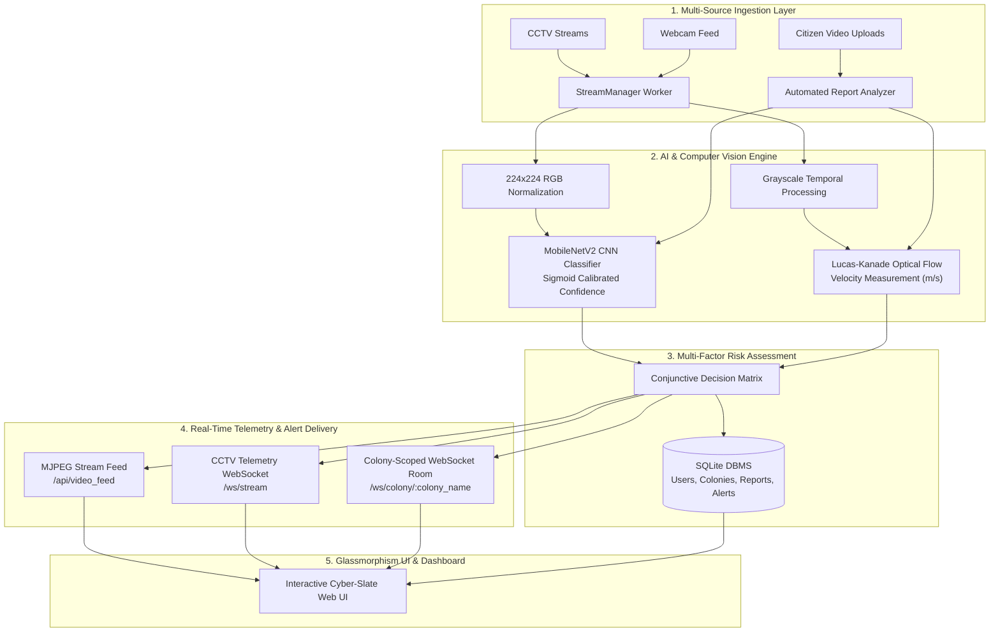

# 🌊 FloodGuard AI 2.0
### Autonomous Hydrodynamic Flood Monitoring & Colony-Scoped Emergency Broadcast Network

[](https://www.python.org/)
[](https://fastapi.tiangolo.com/)
[](https://www.tensorflow.org/)
[](https://opencv.org/)
[](https://www.sqlite.org/)
[](https://websockets.readthedocs.io/)
[](https://opensource.org/licenses/MIT)

---

## 📌 Executive Overview

**FloodGuard AI** is an advanced, production-ready disaster management and hydrodynamic analytics platform developed as a **Final Year Engineering Major Project in Computer Science & Engineering / Artificial Intelligence & Machine Learning**. 

The system unifies:
1. **Deep Convolutional Neural Networks (`MobileNetV2`)** for real-time spatial flood hazard classification.
2. **Lucas-Kanade Optical Flow Engine** for quantifying physical water surface flow velocities ($m/s$).
3. **Colony / Area-Scoped Citizen Network** enabling residents to submit geotagged flood videos.
4. **Automated ML Verification** that autonomously samples frames, calculates flow velocity & flood probability, generates thumbnails, and weeds out false alarms.
5. **Real-Time Location-Scoped WebSocket Emergency Broadcasts** delivering instantaneous audio-visual emergency alerts to all residents connected within that specific colony/area.

---

## 🏗️ System Architecture & Data Flow



---

## 📐 Mathematical Foundations

### 1. Lucas-Kanade Optical Flow Constraint Equation
Under the brightness constancy assumption:
$$I(x, y, t) = I(x + \delta x, y + \delta y, t + \delta t)$$

Applying first-order Taylor series expansion yields the optical flow constraint equation:
$$\nabla I \cdot \mathbf{v} + \frac{\partial I}{\partial t} = 0 \quad \iff \quad I_x u + I_y v + I_t = 0$$

For a local neighborhood window $\Omega$ containing $n$ feature points:
$$\begin{bmatrix} I_x(p_1) & I_y(p_1) \\ I_x(p_2) & I_y(p_2) \\ \vdots & \vdots \\ I_x(p_n) & I_y(p_n) \end{bmatrix} \begin{bmatrix} u \\ v \end{bmatrix} = - \begin{bmatrix} I_t(p_1) \\ I_t(p_2) \\ \vdots \\ I_t(p_n) \end{bmatrix} \implies \mathbf{A}\mathbf{v} = \mathbf{b}$$

Solved via standard least-squares minimization:
$$\mathbf{v} = (\mathbf{A}^T \mathbf{A})^{-1} \mathbf{A}^T \mathbf{b}$$

### 2. Physical Surface Velocity Conversion ($m/s$)
$$v_{\text{surface}} = \left( \frac{1}{N} \sum_{i=1}^N \sqrt{(x_{i, t} - x_{i, t-1})^2 + (y_{i, t} - y_{i, t-1})^2} \right) \times S \times \text{FPS}$$

Where:
- $S = 0.05 \, \text{meters/pixel}$ (spatial scale factor calibrated for standard CCTV vantage).
- $\text{FPS}$ is the real-time frame processing frequency.

### 3. Calibrated Neural Flood Probability
The pre-trained MobileNetV2 binary output sigmoid is calibrated to flood likelihood:
$$P(\text{Flood}) = \left( 1.0 - \sigma(\mathbf{w}^T \mathbf{x} + b) \right) \times 100\%$$

---

## 🌟 Key Features

### 1. 🏘️ Colony / Area Authentication & Resident Directory
- Colony-scoped registration & login with **PBKDF2-HMAC-SHA256** encrypted password hashing.
- Live validation checks for **10-digit Indian mobile numbers**, **valid email formats**, and **matching passwords**.
- Automatic colony room association and alert subscription.

### 2. 📹 Citizen Video Reporting & Automated AI Verification
- Residents can upload videos along with landmarks (e.g. *Gate No. 2, Market Road*).
- Backend **Report Analyzer** samples key frames, calculates average & peak flood probability + optical flow velocity, generates a preview thumbnail, and flags status (`VERIFIED FLOOD`, `WARNING`, `SAFE`).
- Verified reports instantly update the active colony hazard level and trigger area broadcasts.

### 3. 📡 Location-Scoped WebSocket Emergency Broadcasts
- Real-time notification channel (`ws://.../ws/colony/{colony_name}`).
- Alerts only residents in the affected colony with animated emergency top banners and Web Audio API synthesized warning sirens.

### 4. 🎥 Thread-Safe Live Stream Analyzer
- Single-worker background ingestion eliminates OpenCV threading race conditions.
- Real-time yellow flow vector overlay toggle & on-screen HUD.
- Dual-axis Chart.js visualization plotting sliding-window confidence and velocity.

### 5. 🎬 High-Definition Community Video Modal Player
- Residents can click any card thumbnail or *"Watch Video"* to view full video recordings with complete media controls, landmark metadata, and AI verification details.
- *"Load into Live Stream Analyzer"* button enables streaming the uploaded video in the primary real-time pipeline.

---

## 📂 Project Directory Structure

```
floodguard-ai/
├── templates/
│   └── index.html             # Responsive Glassmorphism Dashboard UI
├── static/
│   ├── style.css              # Cyber-slate responsive styling
│   └── script.js              # Real-time WebSocket, Chart.js & Modal Controller
├── uploads/
│   └── thumbnails/            # AI-generated video preview thumbnails
├── config.py                  # Environment & threshold settings
├── database.py                # SQLAlchemy SQLite session & colony seeding
├── models.py                  # Database ORM models (User, Colony, Report, Alert, Log)
├── schemas.py                 # Pydantic v2 validation schemas
├── vision.py                  # MobileNetV2 CNN & Lucas-Kanade Optical Flow engine
├── stream_manager.py          # Thread-safe video stream worker
├── report_analyzer.py         # Automated crowdsourced video ML analyzer
├── colony_notifier.py         # Location-scoped WebSocket room broadcaster
├── main.py                    # FastAPI application, lifespan & REST/WS routes
├── run.py                     # Easy launcher script
├── requirements.txt           # Python dependencies
├── flood_model.h5             # Trained MobileNetV2 deep learning weights
├── t4.mp4                     # Demo test flood video
├── Dockerfile                 # Containerization specification
├── .gitignore                 # Production git ignore configuration
└── README.md                  # Complete technical documentation
```

---

## 🚀 Quick Start & Installation

### 1. Clone the Repository
```bash
git clone https://github.com/123angmish/floodguard-ai.git
cd floodguard-ai
```

### 2. Create and Activate Virtual Environment
```bash
# Windows
python -m venv venv
venv\Scripts\activate

# Linux / macOS
python3 -m venv venv
source venv/bin/activate
```

### 3. Install Dependencies
```bash
pip install -r requirements.txt
```

### 4. Run the Application
```bash
python run.py
# Or directly via Uvicorn:
uvicorn main:app --host 127.0.0.1 --port 8000 --reload
```

### 5. Open Web Dashboard
Navigate to:
```
http://127.0.0.1:8000
```

---

## 📡 REST & WebSocket API Specification

| Method | Endpoint | Description |
|---|---|---|
| `GET` | `/` | Responsive Cyber-Slate Dashboard UI |
| `GET` | `/api/video_feed` | High-performance MJPEG video stream with telemetry HUD |
| `WS` | `/ws/stream` | Real-time WebSocket broadcasting velocity, confidence & risk level |
| `WS` | `/ws/colony/{colony_name}` | Location-scoped WebSocket room for emergency alerts & community updates |
| `POST` | `/api/auth/register` | Register colony resident account with email, phone & PBKDF2 password |
| `POST` | `/api/auth/login` | Resident authentication and colony association |
| `GET` | `/api/colonies` | Retrieve list of all colonies and active threat levels |
| `POST` | `/api/reports/upload` | Citizen video upload with automated ML verification & broadcast |
| `GET` | `/api/reports` | Get crowdsourced community incident reports filtered by colony |
| `POST` | `/api/reports/{id}/upvote` | Community validation / upvote for active incident reports |
| `GET` | `/api/alerts` | Get emergency broadcast history for active colony |
| `POST` | `/api/change_source` | Switch live stream input between `demo`, `webcam`, and `upload` |
| `POST` | `/api/upload_video` | Upload custom `.mp4` video files directly into live CCTV stream |
| `GET` | `/api/stats` | Retrieve aggregate metrics (peak velocity, critical alerts, uptime) |
| `GET` | `/api/export` | Download full incident report as a CSV file |

---

## 👥 Contributors & Academic Acknowledgments

Developed by **Angel Mishra** as a **Final Year Major Project** for automated flood hazard identification, hydrodynamic flow velocity measurement, and community disaster response.

---

## 📄 License
This project is licensed under the [MIT License](LICENSE).
