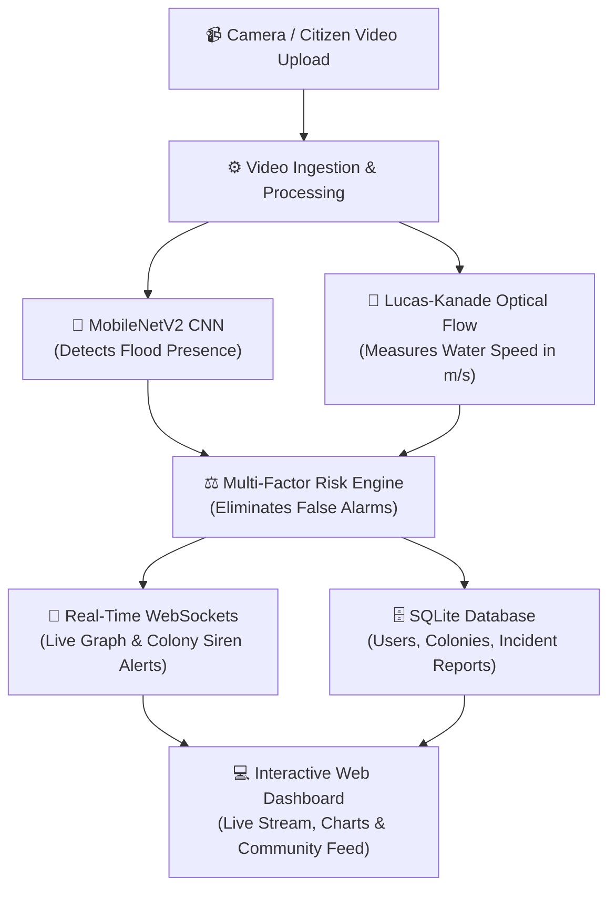

# 🌊 FloodGuard AI
### Autonomous Flood Detection & Colony Emergency Alert Network

[](https://www.python.org/)
[](https://fastapi.tiangolo.com/)
[](https://www.tensorflow.org/)
[](https://opencv.org/)
[](https://opensource.org/licenses/MIT)

> 🎓 **Final Year Engineering Major Project (AI & ML / CSE)**  
> An intelligent disaster management platform that uses **Deep Learning AI** and **Computer Vision** to detect floods from live cameras, measure water flow speed, and send **real-time emergency siren alerts** to specific colony residents.

---

## 💡 What is FloodGuard AI?

During heavy urban rainfall, roads and residential colonies get submerged rapidly. Traditional monitoring relies on manual inspections or expensive drainage sensors that frequently fail. Furthermore, standard AI image classifiers often trigger **false alarms** on harmless rain puddles or wet roads.

**FloodGuard AI solves this with a smart dual-technology approach:**
1. **AI Visual Detection (MobileNetV2):** Scans the video frame to check if flood water is present (~99.6% accuracy).
2. **Water Speed Physics (Lucas-Kanade Optical Flow):** Tracks moving surface ripples to calculate how fast the water is actually flowing ($m/s$).
3. **Colony-Wise Citizen Network:** Residents can upload videos of waterlogging in their area. The AI automatically verifies the video and pushes an **instant emergency siren broadcast** to everyone connected to that colony.

---

## 🏗️ How It Works (System Architecture)



---

## ✨ Key Features

- **🧠 Real-Time AI Flood Classification:** Uses a lightweight `MobileNetV2` neural network to analyze video frames in real-time (<30ms per frame).
- **🌊 Live Water Velocity Measurement:** Tracks surface movement using Optical Flow to display water speed ($m/s$) with yellow flow vectors on the screen.
- **🚫 Zero False Alarms:** Combining image recognition + flow speed ensures stationary puddles or wet roads don't trigger emergency alarms.
- **🏘️ Colony-Based Registration & Logins:** Residents can select/register their specific colony (e.g. *Sector 62 Noida, Gomti Nagar Lucknow*) with secure password encryption.
- **📹 Citizen Video Upload & Auto-AI Verification:** Colony residents can upload flood videos with landmarks (e.g. *Main Gate 2*). The AI autonomously analyzes the video, creates a preview thumbnail, and flags it as `VERIFIED FLOOD`.
- **🚨 Location-Scoped Live Siren Broadcasts:** When a flood is verified, a high-priority warning banner and audio siren are sent **only to residents in that specific colony**.
- **🎬 Community Video Player:** Residents can click any report to watch the uploaded video in full view, inspect AI confidence scores, and upvote reports.
- **📊 Live Dual-Axis Graph:** Real-time Chart.js graph plotting Flood Probability (%) and Flow Velocity ($m/s$) simultaneously.

---

## 🛠️ Tech Stack & Why It Was Used

| Technology | Category | Why We Used It (Simple Explanation) |
|---|---|---|
| **Python** | Language | Core programming language for AI, data handling, and backend logic. |
| **FastAPI** | Web Framework | Ultra-fast, modern backend supporting asynchronous requests and WebSockets. |
| **TensorFlow / Keras** | Deep Learning | Loads and runs the `MobileNetV2` neural network model (`flood_model.h5`). |
| **OpenCV (`cv2`)** | Computer Vision | Captures video frames, extracts grayscale motion gradients, and streams MJPEG video. |
| **Lucas-Kanade Optical Flow** | Physics / Motion | Calculates pixel movement across consecutive frames to measure water speed ($m/s$). |
| **WebSockets** | Real-Time Protocol | Pushes live sensor data to graphs and emergency siren alerts to colony residents instantly. |
| **SQLite & SQLAlchemy** | Database & ORM | Stores users, colonies, verified reports, and logs with secure transaction management. |
| **Chart.js** | Data Visualization | Renders smooth real-time sliding-window graphs on the frontend. |
| **HTML5 / CSS3 / Vanilla JS** | Frontend | Clean, responsive cyber-dark UI with modals, buttons, and live stream player. |

---

## 🚀 Quick Start Guide (Run in 3 Steps)

### Step 1: Clone the Repository
```bash
git clone https://github.com/123angmish/floodguard-ai.git
cd floodguard-ai
```

### Step 2: Install Dependencies
Make sure you have Python 3.10+ installed, then run:
```bash
pip install -r requirements.txt
```

### Step 3: Start the Application
```bash
python run.py
```
*(Or run via Uvicorn: `uvicorn main:app --host 127.0.0.1 --port 8000 --reload`)*

Now open your web browser and navigate to:
👉 **`http://127.0.0.1:8000`**

---

## 📂 Project Directory Structure

```
floodguard-ai/
├── templates/
│   └── index.html             # Responsive Dashboard UI (HTML5)
├── static/
│   ├── style.css              # Cyber-slate styling (CSS3)
│   └── script.js              # Real-time WebSocket & Chart controller (JS)
├── uploads/
│   └── thumbnails/            # Auto-generated preview thumbnails of citizen reports
├── config.py                  # Threshold settings and environment configs
├── database.py                # Database connection & default colony seed data
├── models.py                  # Database tables (Users, Colonies, Reports, Alerts)
├── schemas.py                 # Input validation & data formatting
├── vision.py                  # MobileNetV2 AI classifier & Optical Flow engine
├── stream_manager.py          # Thread-safe video stream worker
├── report_analyzer.py         # Automated AI verification for citizen uploads
├── colony_notifier.py         # Location-scoped WebSocket room broadcaster
├── main.py                    # FastAPI server routes & endpoints
├── run.py                     # One-click launcher script
├── requirements.txt           # Required Python packages
├── flood_model.h5             # Trained Deep Learning weights
├── t4.mp4                     # Demo flood test video
└── README.md                  # Project documentation
```

---

## 🎯 Placement & Interview Highlights (Why This Project Stands Out)

1. **Dual-Modal Intelligence (Vision + Physics):**  
   Instead of just running a simple image classifier, this project combines **Convolutional Neural Networks** with **Differential Optical Flow Physics** to calculate physical speed ($m/s$), virtually eliminating false alarms.

2. **Real-Time Distributed Architecture:**  
   Uses **FastAPI WebSockets** to create isolated room channels per colony, broadcasting localized disaster alerts within milliseconds.

3. **Thread-Safe Video Processing:**  
   Solves common multi-client video streaming crashes by implementing a **Singleton Background Stream Worker** with mutex locks.

4. **Production-Ready DBMS & Security:**  
   Features complete database schema modeling, Pydantic v2 validation, and **PBKDF2-HMAC-SHA256 (100,000 rounds)** salted password hashing.

---

## 👤 Author & Academic Acknowledgments

Developed by **Angel Mishra** as a **Final Year Major Engineering Project**.

- **GitHub:** [@123angmish](https://github.com/123angmish)
- **Project Repository:** [https://github.com/123angmish/floodguard-ai](https://github.com/123angmish/floodguard-ai)
- **License:** [MIT License](LICENSE)
